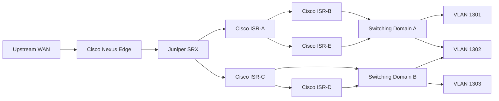

# Enterprise Network Infrastructure

Summarized portfolio documentation for a **Spring 2026 Purdue University CNIT 34500** team project focused on designing, configuring, validating, and troubleshooting a multi-vendor enterprise network.

> This repository is a portfolio reconstruction, not a copy of the original lab submission. Credentials, private infrastructure details, raw device exports, and course-specific answer material are intentionally excluded.

## Project highlights

- Cisco IOS / NX-OS, Juniper Junos, and HPE switching
- IPv4 and IPv6 routing
- Multi-area OSPF and OSPFv3
- EIGRP and OSPF/EIGRP route redistribution
- VLAN segmentation and 802.1Q trunking
- Layer 3 switching
- HSRP and GLBP first-hop redundancy
- DHCP / DHCP relay
- DNS, NTP, SSH, and centralized TFTP configuration backup
- LAN/WAN validation and cross-vendor troubleshooting

## Simplified architecture

The original topology contained additional routed transit links and access/distribution devices; this diagram is intentionally simplified for a public portfolio.

## What the project demonstrates

### Routing
OSPF provided link-state routing across the routed core, while EIGRP was used in separate routing domains. Redistribution enabled reachability between those domains. IPv6 portions of the network also used OSPFv3.

### Segmentation
VLANs separated endpoint networks, while 802.1Q trunks carried multiple VLANs across switched links. Routed VLAN interfaces and router subinterfaces provided Layer 3 connectivity.

### High availability
HSRP and GLBP were implemented during the project to provide redundant virtual default gateways for routed VLANs.

### Operations
The environment also used DHCP, DNS, NTP, SSH, and TFTP-based configuration backups, reinforcing that reliable enterprise networking depends on operational services as well as routing protocols.

## Representative configs

- [Cisco IOS router](configs/cisco/ios-router-sample.cfg)
- [Cisco IOS switch](configs/cisco/ios-switch-sample.cfg)
- [Cisco NX-OS](configs/cisco/nxos-sample.cfg)
- [Juniper SRX](configs/juniper/srx-sample.set)
- [HPE switch](configs/hpe/switch-sample.txt)

These are **sanitized representative examples**, not raw course exports and not production-ready configurations.

## Documentation

- [Architecture](docs/architecture.md)
- [Routing design](docs/routing-design.md)
- [Layer 2 design](docs/layer2-design.md)
- [Redundancy](docs/redundancy.md)
- [Infrastructure services](docs/infrastructure-services.md)
- [Validation](docs/validation.md)
- [Troubleshooting](docs/troubleshooting.md)

## What I learned

- How to translate the same routing and switching concepts across multiple vendors.
- How OSPF/EIGRP routing, VLANs, and first-hop redundancy interact in a larger topology.
- Why DNS, NTP, SSH, DHCP, and configuration backups are core network operations requirements.

## Academic context

This was a **team-based academic implementation** completed in Spring 2026. The repository summarizes the architecture and technical work demonstrated by the project without publishing the original course submission.
